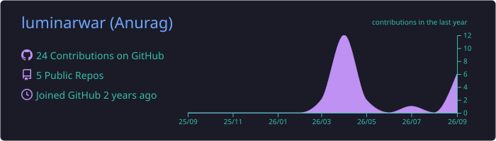
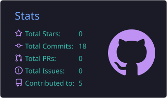
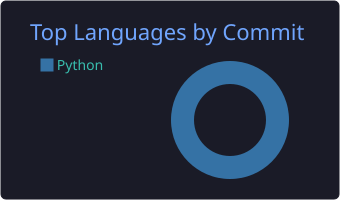

<!-- Header banner -->


<div align="center">


<br/>

<a href="https://www.linkedin.com/in/anurag-kumar-3916a9209/"></a>
<a href="https://github.com/luminarwar"></a>


</div>

<br/>

## About me

I work on the practical side of **Generative AI** — agents, retrieval pipelines, and applied ML systems that actually *do* something: answer questions over documents, query databases in plain English, or recommend a movie you'll genuinely like.

```python
anurag = {
    "building":   ["agentic apps", "RAG pipelines", "OCR-based document search"],
    "learning":   ["advanced RAG architectures", "multi-agent orchestration", "LLM tooling"],
    "ask_me_about": ["LangChain", "RAG", "recommender systems"],
    "reach_me":   "linkedin.com/in/anurag-kumar-3916a9209",
}
```

## Tech stack

<div align="center">

**Languages & data**<br/>


**LLMs & GenAI**<br/>


**Apps & tools**<br/>


</div>

## Featured projects

<table>
<tr>
<td width="50%" valign="top">

### 🤖 [GEN-AI-Projects](https://github.com/luminarwar/GEN-AI-Projects)
A growing collection of hands-on GenAI builds: a Q&A bot, a Google-powered agent, a Groq-accelerated chatbot, a natural-language SQL agent, and a RAG agent.

`Python` `LangChain` `Groq` `SQL`

</td>
<td width="50%" valign="top">

### 📄 [DocMe — RAG Agent with OCR](https://github.com/luminarwar/DocMe---RAG-agent-with-ocr)
A document-intelligence agent that combines OCR with retrieval-augmented generation, so you can query scanned or image-based documents in natural language.

`Python` `RAG` `OCR`

</td>
</tr>
<tr>
<td width="50%" valign="top">

### 🔬 [RSRCH — Multi-Agent Research Assistant](https://github.com/luminarwar/RSRCH---Multi-Agent-Research-Assistant)
Specialized agents collaborate to research a topic and compile the findings — an early step into agentic orchestration.

`Python` `Multi-Agent` `LLM Orchestration`

</td>
<td width="50%" valign="top">

### 🎬 [Movie Recommender System](https://github.com/luminarwar/Movie-Recommender-System)
A content-based recommendation engine that suggests similar titles using metadata and similarity scoring.

`Python` `Machine Learning` `Recommender Systems`

</td>
</tr>
</table>

## GitHub stats

<!-- These cards are generated inside this repo by .github/workflows/profile-summary-cards.yml -->
<div align="center">







</div>

<br/>

<div align="center">

*Thanks for stopping by — explore the repos or say hi on [LinkedIn](https://www.linkedin.com/in/anurag-kumar-3916a9209/).*

</div>


