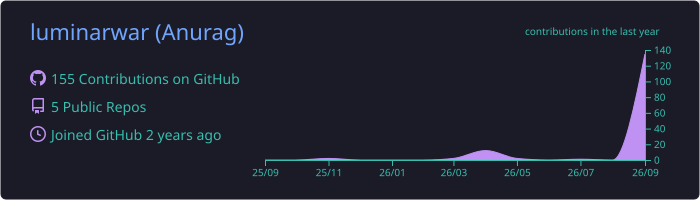
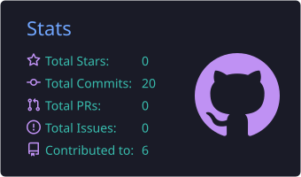
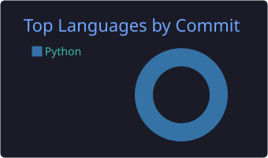

<!-- ───────────── Header (switches with GitHub light/dark theme) ───────────── -->
<picture>
  <source media="(prefers-color-scheme: dark)" srcset="https://capsule-render.vercel.app/api?type=rect&height=170&color=0:0d1117,60:2a2470,100:6C63FF&text=Anurag%20Kumar&fontColor=ffffff&fontSize=48&fontAlignY=42&desc=GenAI%20%E2%86%92%20Embodied%20AI&descAlignY=68&descSize=17" />
  
</picture>

<div align="center">


<a href="https://www.linkedin.com/in/anurag-kumar-3916a9209/"></a>
<a href="https://github.com/luminarwar?tab=followers"></a>
<a href="https://github.com/luminarwar/JACKOBIAN"></a>

</div>

---

### 👋 Hi, I'm Anurag

I build applied **Generative AI** systems — agents that query databases in plain English, RAG pipelines that can read scanned documents, and teams of LLM agents that research a topic together.

Lately I've been pulling those agents off the screen and into the physical world: I'm working through a long-term, self-directed course in **robotics and embodied AI** — kinematics, control, perception, ROS 2, and robot learning.

<table>
<tr>
<td width="33%" valign="top">

**🔨 Building**<br/>
Agentic apps, RAG + OCR document search, multi-agent research tools

</td>
<td width="33%" valign="top">

**📚 Learning**<br/>
Robotics math, kinematics & Jacobians, control, ROS 2, RL & imitation learning

</td>
<td width="33%" valign="top">

**💬 Ask me about**<br/>
LangChain, RAG design, recommender systems, getting started with GenAI

</td>
</tr>
</table>

---

### 🛰️ Current mission — [JACKOBIAN](https://github.com/luminarwar/JACKOBIAN)

> Robotics & Embodied AI from the ground up — named after the **Jacobian**, the matrix that links joint motion to end-effector motion.

```text
progress  ■□□□□□□□□  phase 0 / 8

  0  Setup + Python            ◀ you are here
  1  Math for robotics
  2  Kinematics (FK / IK / Jacobians)
  3  Dynamics & control  ·  MuJoCo
  4  Electronics  ·  first real robot (ESP32)
  5  Perception  ·  Kalman filters  ·  SLAM
  6  Linux + ROS 2
  7  Robot learning  ·  RL  ·  imitation  ·  VLAs
  8  Specialization  ·  humanoids / drones
```

---

### 🧪 Featured GenAI work

<table>
<tr>
<td width="50%" valign="top">

#### 📄 [DocMe](https://github.com/luminarwar/DocMe---RAG-agent-with-ocr)
**RAG agent with OCR.** Ask questions of scanned and image-based documents in plain language — OCR extracts the text, retrieval grounds the answers.

  

</td>
<td width="50%" valign="top">

#### 🔬 [RSRCH](https://github.com/luminarwar/RSRCH---Multi-Agent-Research-Assistant)
**Multi-agent research assistant.** Specialized agents split up a research question, gather findings, and compile them into one report.

  

</td>
</tr>
<tr>
<td width="50%" valign="top">

#### 🤖 [GEN-AI-Projects](https://github.com/luminarwar/GEN-AI-Projects)
**A lab notebook of GenAI builds** — Q&A bot, Google-powered agent, Groq chatbot, natural-language SQL agent, and a RAG agent.

   

</td>
<td width="50%" valign="top">

#### 🎬 [Movie Recommender](https://github.com/luminarwar/Movie-Recommender-System)
**Content-based recommendation engine** that suggests similar titles from movie metadata and similarity scoring.

  

</td>
</tr>
</table>

---

### 🧰 Toolbox

| | |
|---|---|
| **Core** |      |
| **LLMs & GenAI** |      |
| **Apps & workflow** |     |
| **Learning next** |     |

---

### 📈 Activity

<!-- Generated in this repo by .github/workflows/profile-summary-cards.yml -->
<div align="center">






</div>

---

<div align="center">

<sub>Building agents today, robots tomorrow. Thanks for stopping by — say hi on <a href="https://www.linkedin.com/in/anurag-kumar-3916a9209/">LinkedIn</a>.</sub>

</div>
